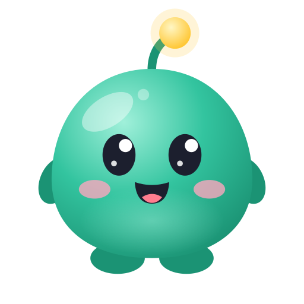
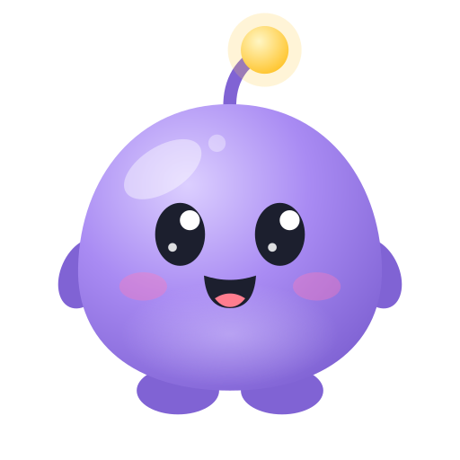
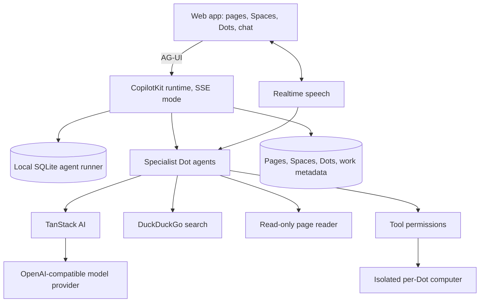

<div align="center">


   

# FullDots

### Self-hosted AI coworkers with their own computers, and you in full control.

**A fully local fork of [CopilotKit OpenDots](https://github.com/CopilotKit/OpenDots): conversations stay on your machine, web search needs no key, and nothing is sent to analytics.**

[Get started](#get-started) · [What's different](#whats-different-from-opendots) · [Features](#features) · [Credits](#credits) · [Contributing](CONTRIBUTING.md)

[](./LICENSE)


</div>

---

> FullDots is an independent project based on [OpenDots](https://github.com/CopilotKit/OpenDots) by CopilotKit, used under the MIT License. It is not affiliated with or endorsed by CopilotKit. See [NOTICE.md](NOTICE.md).

## Overview

FullDots is a personal agent workspace you run yourself. Create Specialist Dots with their own roles and permissions, give each one an isolated computer, and keep your documents in Spaces. Everything except the model call runs on your own machine.

### Spaces

A Space is a home for working documents. Browse pages in a searchable library, organize them as nested subpages, and edit them in a visual editor with slash commands, autosave, and revision checks. Write directly, save a conversation as a page, or ask a Dot to create and revise content.

### Specialist Dots

Give each Dot a name, role, instructions, and permitted tools. A researcher can investigate a topic; a writer can turn findings into a draft. Grant each Dot access to the Spaces it needs.

### Dot computers

Each Dot can have its own computer, using [OpenBot](https://github.com/CopilotKit/OpenBot)'s container supervisor and computer service. Its browser profile and workspace files persist across stop/start. The Computer panel exposes browser control, human takeover, files, terminal, and activity, with browser, file, and shell permissions set per Dot. See [Computer setup](docs/COMPUTERS.md).

### Review before saving

Ask a Dot to show a draft before saving it. A human-in-the-loop card pauses the conversation for **Approve & save** or **Decline**.

### Text and calls

A continuous conversation with text and call controls. Calls pair realtime speech with a compute agent that uses the same conversation and tool permissions. Voice needs separate provider configuration.

## What's different from OpenDots

| Area          | OpenDots                                      | FullDots                                                            |
| ------------- | --------------------------------------------- | ------------------------------------------------------------------- |
| Conversations | Stored in CopilotKit Intelligence (hosted)    | Stored locally in SQLite by a built-in agent runner                 |
| Web search    | Parallel (sends queries and URLs to Parallel) | DuckDuckGo with no API key, plus a local read-only page reader      |
| Telemetry     | CopilotKit runtime telemetry on by default    | Disabled in code before the runtime loads                           |
| Required keys | Intelligence key + model key                  | Model key only (any OpenAI-compatible provider, such as OpenRouter) |
| Slack         | Managed Slack channel through Intelligence    | Removed (it depends on Intelligence)                                |
| Learning      | CopilotKit Automatic Learning                 | Removed (it depends on Intelligence)                                |
| Server turns  | Voice and scheduled turns over a WebSocket    | Run in process through the same local runner                        |

The only outbound traffic is your model provider, the DuckDuckGo search queries, and the pages a Dot reads or browses.

## Architecture



## Get started

Use **Node.js 24** and **npm**:

```sh
git clone https://github.com/asasemahmed/FullDots.git
cd FullDots
npm ci
cp .env.example .env
npm run dev
```

Set `OPENAI_API_KEY`, `OPENAI_BASE_URL`, and `OPENAI_MODEL` in `.env`, then open **http://127.0.0.1:5173**. You can create Spaces, write pages, and configure Dots before adding a model key.

See [Setup](docs/SETUP.md) for the page reader, calls, Docker, and computers.

## Features

| Area                       | Included                                                                                  |
| -------------------------- | ----------------------------------------------------------------------------------------- |
| Spaces and Specialist Dots | Saved names, role instructions, and per-Dot research and memory permissions               |
| Pages                      | Searchable library, visual editor, slash commands, autosave, and revision checks          |
| Conversations              | Local SQLite thread storage, page-specific conversations, and source links                |
| Web research               | Keyless DuckDuckGo search and a separate read-only page reader                            |
| Calls                      | WebRTC speech, delegated compute, bounded sessions, hangup, and timeline receipts         |
| Background work            | Scheduled server-side turns in their original conversation, with pause and retry controls |
| Dot computers              | Per-Dot browser profiles, files, shell, takeover, permissions, and action records         |
| Memory                     | User-managed preferences that permitted Dots can use                                      |
| Deployment                 | Local Node setup and separate application/browser containers                              |

This is a single-owner starting point. Shared editing, invitations, and file uploads are not included.

### Connectors and approvals

Connectors give a Dot tools from outside FullDots through the Model Context Protocol. Add one in **Settings → Connectors**, from a preset or as a custom server. Most hosted presets sign in with your browser; others take a token from `.env`. Local programs (stdio) stay off until `CONNECTORS_ALLOW_STDIO=true`. Each Dot gets only the connector tools you grant it. Read-only tools are granted by default; tools that change data stay off until you tick them.

By default, a Dot pauses before sensitive actions, such as sending, submitting, paying, or deleting, and before destructive shell commands. The **Approvals** setting on each Dot can ask before more actions. You approve the exact action shown on the card, once. When a page needs a password, a code, or a human check, the Dot hands the computer to you and stops. It never types those values.

See [Connectors](docs/CONNECTORS.md) and [Approvals](docs/APPROVALS.md).

### Model providers

Add OpenAI, Anthropic, Gemini, OpenRouter, Groq, and other providers in **Settings → Models**, with a pasted key or a `.env` variable. Each Dot can use a different provider and model. See [Models](docs/MODELS.md).

## Contributing

See [Contributing](CONTRIBUTING.md) for development guidance and [Security](SECURITY.md) for reporting issues.

## Credits

FullDots is built on [OpenDots](https://github.com/CopilotKit/OpenDots), created by Atai Barkai and the CopilotKit team, and keeps its full commit history. It also relies on [CopilotKit](https://github.com/CopilotKit/CopilotKit), [AG-UI](https://docs.ag-ui.com/introduction), [TanStack AI](https://tanstack.com/ai), and [OpenBot](https://github.com/CopilotKit/OpenBot). The local runner is adapted from CopilotKit's MIT-licensed `@copilotkit/sqlite-runner`.

## License

[MIT](LICENSE). The original OpenDots copyright notice is retained.
