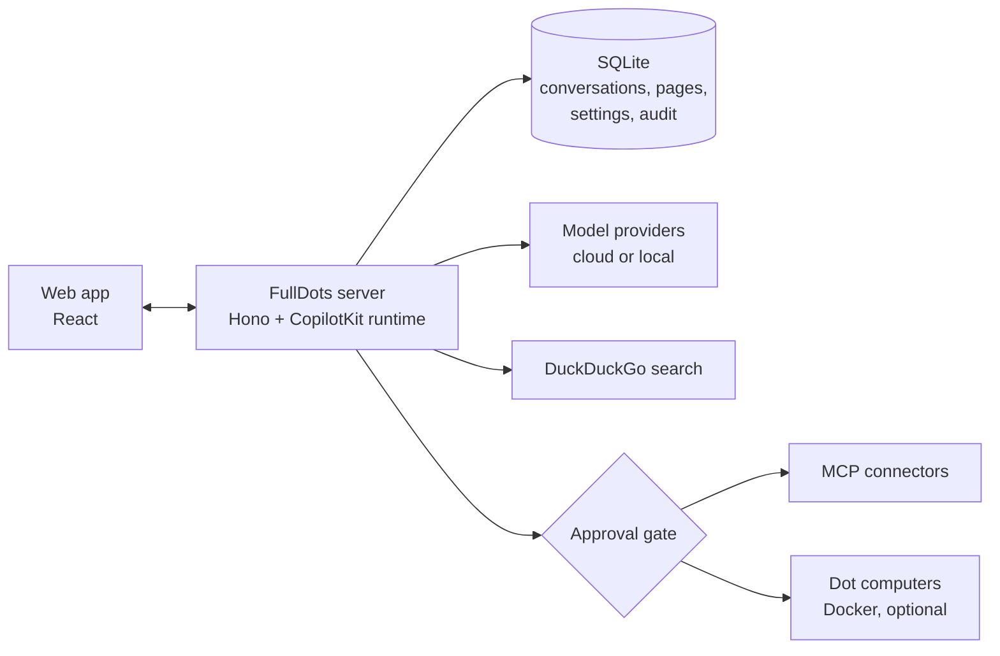

<div align="center">

<picture>
  <source media="(prefers-color-scheme: dark)" srcset="docs/brand/fulldots-logo-light.svg" />
  
</picture>

<br />

   

### AI coworkers with their own computers.

Self-hosted and local-first. Bring any model, connect your tools, and approve every risky action.

[](https://github.com/asasemahmed/FullDots/actions/workflows/ci.yml)
[](LICENSE)


[Quick start](#quick-start) · [Features](#features) · [How it works](#how-it-works) · [Documentation](#documentation) · [FullDots and OpenDots](#fulldots-and-opendots)

</div>

<br />


FullDots is a workspace for AI agents called **Dots**. Each Dot has a role, instructions, a model, the tools you grant it and, optionally, its own computer with a browser, files and a shell. You chat with a Dot, schedule work for it and review what it did.

Everything runs on your machine. Conversations, pages and settings are stored in one SQLite file, there is no account and no telemetry, and the app contacts only the services you configure.

> [!NOTE]
> FullDots is alpha software, built for a single owner: there are no user accounts or shared workspaces. It is a fork of [CopilotKit OpenDots](https://github.com/CopilotKit/OpenDots); see [FullDots and OpenDots](#fulldots-and-opendots).

## Features

<table>
<tr>
<td width="50%" valign="top">

#### Local-first by design

Conversations stay in a local SQLite file instead of a hosted thread service. Telemetry is switched off in code, and web search uses DuckDuckGo, so no search key is needed.

</td>
<td width="50%" valign="top">

#### Bring your own model

Fourteen provider presets, from OpenAI and Anthropic to Ollama and LM Studio, plus any OpenAI-compatible server. Keys are encrypted at rest, and each Dot can use its own model.

</td>
</tr>
<tr>
<td valign="top">

#### Connect your tools over MCP

Notion, Linear, Atlassian, Sentry, Stripe, Hugging Face and more. Sign in with your browser, with no OAuth app to register. Each Dot gets only the tools you grant it, read-only by default.

</td>
<td valign="top">

#### Approvals for risky actions

Sending, paying, deleting, publishing and destructive commands pause for you. An approval covers that exact action, once, and a paused turn survives a restart.

</td>
</tr>
<tr>
<td valign="top">

#### You take over for secrets

A Dot stops before it types a password, a verification code or a captcha answer. You take over its live screen, finish the step and hand it back.

</td>
<td valign="top">

#### A computer for each Dot

An optional container per Dot with a browser, files and a shell. Its screen streams into the app, and every action is recorded in an audit trail.

</td>
</tr>
</table>

### At a glance

| Area              | FullDots                                                                                                                      |
| ----------------- | ----------------------------------------------------------------------------------------------------------------------------- |
| **Storage**       | One local SQLite file for conversations, pages, settings and the audit trail                                                  |
| **Models**        | OpenAI, Anthropic, Gemini, OpenRouter, Groq, Mistral, DeepSeek, xAI, Together, Fireworks, Cerebras, Ollama, LM Studio, custom |
| **Connectors**    | MCP over Streamable HTTP with SSE fallback; local programs behind a flag                                                      |
| **Secrets**       | AES-256-GCM at rest, masked in tool results, never sent to the browser                                                        |
| **Concurrency**   | One turn per Dot across chat, voice, schedules and resumes, with a Stop button                                                |
| **Limits**        | Steps, time, shell command time and file size, all set in `.env`                                                              |
| **Notifications** | Optional webhook for new approvals and handoffs (title, text and link only)                                                   |
| **Tests**         | 1,186 tests, including a planted-secret leak test                                                                             |

## Screenshots

|                                                                                                      |                                                                                                            |
| ---------------------------------------------------------------------------------------------------- | ---------------------------------------------------------------------------------------------------------- |
| <br />**Connectors.** A gallery of MCP presets. | <br />**Browser sign-in.** No OAuth app to create. |
| <br />**Models.** Fourteen providers, keys encrypted. | <br />**Dot form.** Identity, model, connectors and approvals.   |
| <br />**Approvals.** The exact action, your decision. | <br />**Per-Dot rules.** Tool grants and when to ask. |

## Quick start

**Requirements:** Node.js 24 or newer with npm, and either an API key for a supported provider or a local [Ollama](https://ollama.com) or [LM Studio](https://lmstudio.ai) server.

### From source

```sh
git clone https://github.com/asasemahmed/FullDots.git
cd FullDots
npm ci
cp .env.example .env
npm run dev
```

Open <http://127.0.0.1:5173>, then add a provider in **Settings → Models**. You can also set `OPENAI_API_KEY`, `OPENAI_BASE_URL` and `OPENAI_MODEL` in `.env` and restart. Without a model, the app shows a setup screen and never invents replies.

### With Docker

```sh
cp .env.example .env    # set OWNER_TOKEN to a random string of 24+ characters
docker compose up --build -d
```

Open <http://localhost:4310>. The port is bound to loopback, and data lives in the `opendots-data` volume.

### Optional extras

- **Dot computers** need Docker. See [Computers](docs/COMPUTERS.md).
- **Page reader, voice calls and backups** are covered in [Setup](docs/SETUP.md).
- **Connectors** are added in **Settings → Connectors**. See [Connectors](docs/CONNECTORS.md).

## How it works



Every turn runs through the server. Before a Dot uses a computer or a connector, the approval gate checks the action against that Dot's grants and approval mode. An action that needs you pauses the turn and is recorded, and the turn resumes once you decide.

## Configuration

All settings live in `.env`. [`.env.example`](.env.example) lists every variable with its default.

| Variable                                            | Purpose                                                                                     |
| --------------------------------------------------- | ------------------------------------------------------------------------------------------- |
| `OPENAI_API_KEY`, `OPENAI_BASE_URL`, `OPENAI_MODEL` | The built-in default provider. Add others in **Settings → Models**.                         |
| `OWNER_TOKEN`                                       | Required (24+ characters) when `HOST` is not loopback, and by the Docker setup.             |
| `APP_ORIGIN`                                        | The exact address you open the app at. Browser sign-in for connectors redirects back to it. |
| `DATABASE_PATH`                                     | The SQLite file. Default `data/opendots.sqlite`.                                            |
| `CONNECTOR_SECRET_KEY`                              | Key for stored secrets. If unset, `data/connector.key` is created once.                     |
| `WEB_SEARCH_PROVIDER`                               | `duckduckgo` (default) or `disabled`.                                                       |
| `CONNECTORS_ALLOW_STDIO`                            | Lets connectors start local programs. Off by default.                                       |
| `AGENT_TURN_TIMEOUT`, `AGENT_MAX_STEPS`             | How long and how many steps a Dot may take in one turn. Defaults: 90 seconds and 8 steps.   |
| `NOTIFY_WEBHOOK_URL`                                | Optional. Receives a title, text and link for new approvals and handoffs.                   |

## Security

- **Your data stays local.** Outbound traffic goes only to your model providers, DuckDuckGo, the connectors you add and the pages a Dot reads.
- **Secrets are encrypted.** Model keys and connector tokens are stored with AES-256-GCM. Secrets set in `.env` are read from the environment and never stored or shown.
- **Remote access needs a token.** The server refuses to start on a non-loopback `HOST` without an `OWNER_TOKEN` of 24+ characters.
- **Risky actions wait for you.** Approvals and handoffs keep you in the loop. The checks are heuristics, not a sandbox; see [Approvals](docs/APPROVALS.md).
- **Leaks are tested.** [`tests/security.test.ts`](tests/security.test.ts) plants secrets where the server keeps them and checks that none reach a response, webhook, model request, stored conversation, audit record or log line.

FullDots has not been independently audited. Read [`SECURITY.md`](SECURITY.md) for the design, its limits and how to report a vulnerability privately.

## Development

```sh
npm test              # Vitest suite
npm run typecheck     # TypeScript, no emit
npm run lint          # ESLint
npm run check-format  # Prettier
npm run build         # production build, then `npm start`
```

<details>
<summary><b>Project layout</b></summary>

```text
src/
  client/    React app: chat, sidebar, settings, Dot form, computer panel
  server/    Hono server: agent runtime, SQLite runner, connectors, approvals, handoff
  shared/    Types and presets shared by client and server
  browser/   Page reader service (Playwright)
tests/       Vitest suites, fixtures and the security regression test
deployment/  Docker images for the app and Dot computers
docs/        Guides, brand assets and screenshots
```

</details>

<details>
<summary><b>Where each feature lives in the code</b></summary>

| Feature                 | Code                                                                                                                                                                |
| ----------------------- | ------------------------------------------------------------------------------------------------------------------------------------------------------------------- |
| Local conversations     | [`sqlite-runner.ts`](src/server/sqlite-runner.ts)                                                                                                                   |
| No telemetry            | [`privacy.ts`](src/server/privacy.ts), imported first in [`index.ts`](src/server/index.ts)                                                                          |
| Keyless web search      | [`web-search.ts`](src/server/web-search.ts)                                                                                                                         |
| Model providers         | [`model-providers.ts`](src/server/model-providers.ts), [`model-presets.ts`](src/shared/model-presets.ts)                                                            |
| Encrypted secrets       | [`connector-crypto.ts`](src/server/connector-crypto.ts)                                                                                                             |
| MCP connectors          | [`connectors.ts`](src/server/connectors.ts), [`connector-oauth.ts`](src/server/connector-oauth.ts), [`connector-auth-store.ts`](src/server/connector-auth-store.ts) |
| Approvals               | [`approval-gate.ts`](src/server/approval-gate.ts), [`approvals.ts`](src/server/approvals.ts), [`resume-queue.ts`](src/server/resume-queue.ts)                       |
| Owner handoff           | [`handoff-service.ts`](src/server/handoff-service.ts), [`handoff-detect.ts`](src/server/handoff-detect.ts)                                                          |
| One turn per Dot        | [`turn-registry.ts`](src/server/turn-registry.ts)                                                                                                                   |
| Live computer view      | [`computer-stream.ts`](src/server/computer-stream.ts), [`computer-panel/`](src/client/computer-panel/)                                                              |
| Work limits             | [`limits.ts`](src/server/limits.ts)                                                                                                                                 |
| Audit and notifications | [`computer-store.ts`](src/server/computer-store.ts), [`notify.ts`](src/server/notify.ts)                                                                            |
| Dot character           | [`DotCharacter.tsx`](src/client/DotCharacter.tsx), [`docs/brand/`](docs/brand/README.md)                                                                            |

</details>

## Documentation

| Guide                            | Covers                                       |
| -------------------------------- | -------------------------------------------- |
| [Setup](docs/SETUP.md)           | Running, Docker, storage, search and backups |
| [Models](docs/MODELS.md)         | Providers, keys and per-Dot models           |
| [Connectors](docs/CONNECTORS.md) | MCP connectors, browser sign-in and grants   |
| [Approvals](docs/APPROVALS.md)   | Modes, what pauses, handoffs and resumes     |
| [Computers](docs/COMPUTERS.md)   | A computer for each Dot                      |
| [Brand](docs/brand/README.md)    | Logo, Dots and colours                       |
| [Changelog](CHANGELOG.md)        | What changed in each release                 |

## FullDots and OpenDots

FullDots was forked from [CopilotKit OpenDots](https://github.com/CopilotKit/OpenDots) at upstream commit `c2569bb` (2 October 2026), and the upstream history is kept in this repository.

|                           | OpenDots at the fork point      | FullDots                                      |
| ------------------------- | ------------------------------- | --------------------------------------------- |
| Conversation storage      | Hosted CopilotKit Intelligence  | Local SQLite                                  |
| Web search                | Parallel by default, with a key | DuckDuckGo, no key                            |
| Telemetry                 | CopilotKit telemetry            | Off                                           |
| Models                    | One provider set in `.env`      | 14 presets, encrypted keys, a model per Dot   |
| Connectors                | None                            | MCP with browser sign-in and per-Dot grants   |
| Approvals and handoff     | None                            | Risky actions pause, and you type the secrets |
| Slack, Automatic Learning | Included                        | Removed (both depend on Intelligence)         |

OpenDots has kept moving since the fork, and none of its later changes are merged here, including dark mode ([#81](https://github.com/CopilotKit/OpenDots/pull/81)), page deletion ([#49](https://github.com/CopilotKit/OpenDots/pull/49)) and its own per-Dot MCP connections ([#52](https://github.com/CopilotKit/OpenDots/pull/52)). If you want what upstream ships today, use OpenDots.

FullDots is an independent project, not affiliated with or endorsed by CopilotKit. Thanks to Atai Barkai and the CopilotKit team for OpenDots, and for [CopilotKit](https://github.com/CopilotKit/CopilotKit), [AG-UI](https://docs.ag-ui.com) and [OpenBot](https://github.com/CopilotKit/OpenBot), which FullDots builds on. See [`NOTICE.md`](NOTICE.md).

## Contributing

Bug reports, fixes and tests are welcome. Please read [`CONTRIBUTING.md`](CONTRIBUTING.md) first, and report security problems privately as described in [`SECURITY.md`](SECURITY.md).

## License

[MIT](LICENSE). Copyright (c) Atai Barkai. Copyright (c) 2026 asemabdallah (FullDots modifications).
