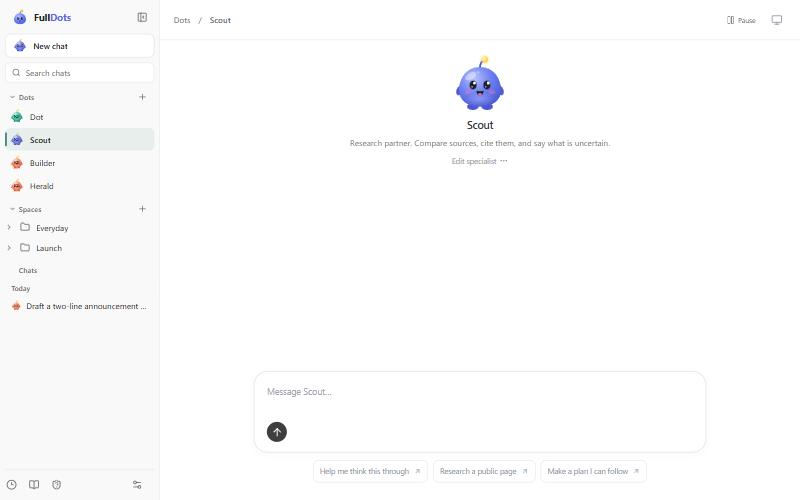
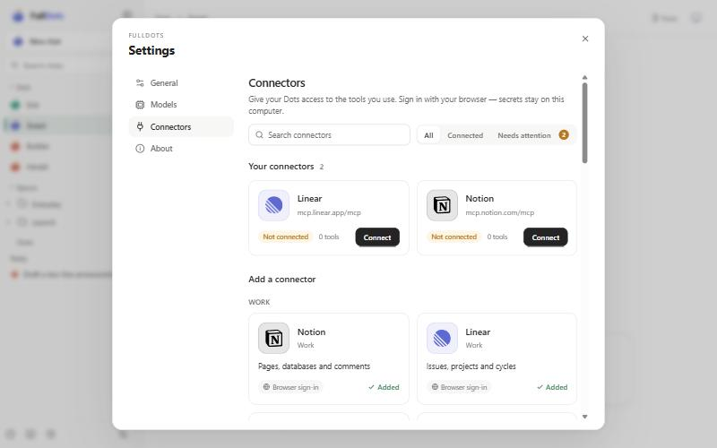
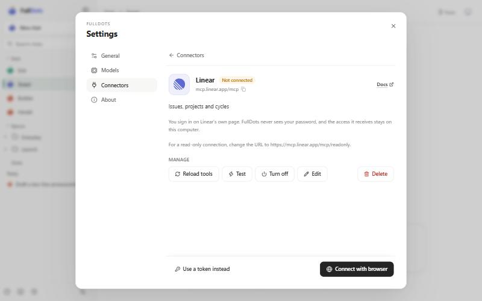
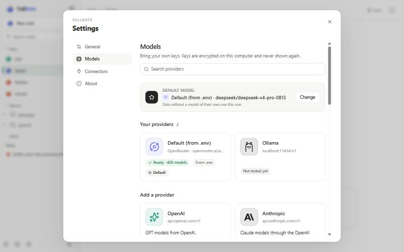
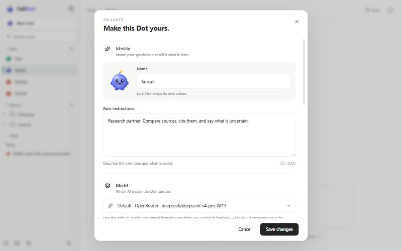
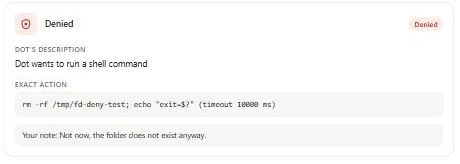
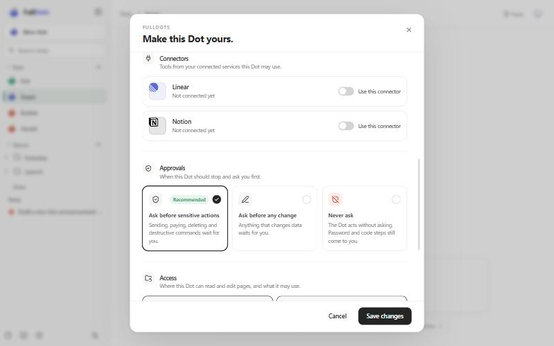

<div align="center">

<picture>
  <source media="(prefers-color-scheme: dark)" srcset="docs/brand/fulldots-logo-light.svg" />
  
</picture>

<br />

   

**Self-hosted AI coworkers with their own computers. Local-first, bring your own model, and you stay in control.**

[](https://github.com/asasemahmed/FullDots/actions/workflows/ci.yml)
[](LICENSE)


[Get started](#get-started) · [Why FullDots](#why-fulldots) · [Documentation](#documentation) · [Relationship to OpenDots](#relationship-to-opendots) · [Contributing](#contributing)

</div>

FullDots is a workspace for AI agents called Dots. Each Dot has a role, instructions, a model, a set of tools, and optionally its own computer with a browser, files and a shell. You chat with a Dot, schedule work for it, and review what it did. Conversations, pages and settings are stored in a SQLite file on your machine. The only services it contacts are the ones you configure.

It is a fork of [CopilotKit OpenDots](https://github.com/CopilotKit/OpenDots) and is in alpha. It is built for one owner: there are no user accounts and no shared workspaces. See [Relationship to OpenDots](#relationship-to-opendots).



## Why FullDots

- **Conversations stay on your machine.** A local SQLite agent runner replaces the hosted CopilotKit Intelligence thread service. No account is needed. Proof: [`src/server/sqlite-runner.ts`](src/server/sqlite-runner.ts), [`docs/SETUP.md`](docs/SETUP.md).
- **No telemetry.** CopilotKit telemetry is switched off before the runtime loads, there is no analytics code, and OpenRouter attribution headers are not sent. Proof: [`src/server/privacy.ts`](src/server/privacy.ts) (imported first in [`src/server/index.ts`](src/server/index.ts)), [`src/shared/model-presets.ts`](src/shared/model-presets.ts).
- **Web search without a key.** Dots search with DuckDuckGo instead of Parallel. Proof: [`src/server/web-search.ts`](src/server/web-search.ts).
- **Bring your own model.** Settings → Models has 14 presets: OpenAI, Anthropic, Gemini, OpenRouter, Groq, Mistral, DeepSeek, xAI, Together, Fireworks, Cerebras, Ollama, LM Studio and any custom OpenAI-compatible server. Keys are encrypted at rest with AES-256-GCM, each Dot can use its own model, and per-provider request differences such as `max_tokens` versus `max_completion_tokens` are handled. Proof: [`src/server/model-providers.ts`](src/server/model-providers.ts), [`src/shared/model-presets.ts`](src/shared/model-presets.ts), [`src/server/connector-crypto.ts`](src/server/connector-crypto.ts), [`docs/MODELS.md`](docs/MODELS.md).
- **Connectors over MCP.** Streamable HTTP with SSE fallback, local programs behind a flag, and browser sign-in with automatic client registration for Notion, Linear, Atlassian, Asana, Intercom, Sentry, Hugging Face, Cloudflare, Supabase, Neon and Stripe. GitHub and PayPal use tokens. Each Dot gets only the tools you grant it, read-only by default. A grant can be revoked while a Dot is running, and tool results are redacted and size-capped. Proof: [`src/server/connectors.ts`](src/server/connectors.ts), [`src/server/connector-oauth.ts`](src/server/connector-oauth.ts), [`src/server/connector-auth-store.ts`](src/server/connector-auth-store.ts), [`docs/CONNECTORS.md`](docs/CONNECTORS.md).
- **Approvals before risky actions.** Actions that send, pay, delete, publish, run destructive shell commands or change data through connectors pause for you. An approval is bound to the exact action and can be used once, on the turn that resumes. Modes are `sensitive`, `writes` and `off`, and a paused turn resumes after a restart. Proof: [`src/server/approval-gate.ts`](src/server/approval-gate.ts), [`src/server/approvals.ts`](src/server/approvals.ts), [`src/server/resume-queue.ts`](src/server/resume-queue.ts), [`docs/APPROVALS.md`](docs/APPROVALS.md).
- **Owner handoff.** Password, verification-code and captcha steps stop the Dot before it types. You take over the live screen and hand it back, and the Dot resumes. Proof: [`src/server/handoff-service.ts`](src/server/handoff-service.ts), [`src/server/handoff-detect.ts`](src/server/handoff-detect.ts).
- **One turn per Dot.** Chat, voice, scheduled tasks and resumes share one lock per Dot. Scheduled tasks skip conversations that are waiting for you, and a Stop button ends background work. Proof: [`src/server/turn-registry.ts`](src/server/turn-registry.ts), [`docs/APPROVALS.md`](docs/APPROVALS.md).
- **Live computer view.** The screen of a Dot's computer is streamed to the app, with controls to take over. Proof: [`src/server/computer-stream.ts`](src/server/computer-stream.ts), [`src/client/computer-panel/`](src/client/computer-panel/).
- **Configurable work limits.** Steps, time, shell command time and file size are set in `.env`. Proof: [`src/server/limits.ts`](src/server/limits.ts), [`.env.example`](.env.example).
- **An audit trail and optional notifications.** Every computer and connector action is recorded in the `action_audit` table. An optional webhook receives only a title, text and link for new approvals and handoffs. Proof: [`src/server/computer-store.ts`](src/server/computer-store.ts), [`src/server/notify.ts`](src/server/notify.ts).
- **A redesigned interface.** A sidebar with search and date groups, tabbed Settings, galleries of connectors and models with brand logos, an approvals view, a Dot form with sections, and a new Dot character whose face and antenna light follow its state. Proof: [`src/client/sidebar/`](src/client/sidebar/), [`src/client/DotCharacter.tsx`](src/client/DotCharacter.tsx), [`docs/brand/`](docs/brand/README.md).
- **A larger test suite.** `npm test` runs 72 test files and 1186 tests, against 35 test files at the fork point. A regression test plants secrets where the server keeps them and checks that none reach a response, webhook, model request, stored conversation, audit record or log line. Proof: [`tests/`](tests/), [`tests/security.test.ts`](tests/security.test.ts).

## Screenshots

|                                                                                                      |                                                                                                                 |
| ---------------------------------------------------------------------------------------------------- | --------------------------------------------------------------------------------------------------------------- |
| <br />**Connectors.** Presets with brand logos. | <br />**Browser sign-in.** No OAuth app to create.      |
| <br />**Models.** Fourteen provider presets.          | <br />**Dot form.** Identity, model, connectors and approvals.        |
| <br />**Approvals.** The exact action, used once.     | <br />**Per-Dot rules.** Connector grants and when to ask. |

## Get started

Prerequisites:

- Node.js 24 or newer (`engines` in [`package.json`](package.json)) and npm.
- A model API key for any supported provider, or a local [Ollama](https://ollama.com) or [LM Studio](https://lmstudio.ai) server.

Run it from source:

```sh
git clone https://github.com/asasemahmed/FullDots.git
cd FullDots
npm ci
cp .env.example .env
npm run dev
```

Open <http://127.0.0.1:5173>. Add a provider in **Settings → Models**, or set `OPENAI_API_KEY`, `OPENAI_BASE_URL` and `OPENAI_MODEL` in `.env` and restart. Without a model the app shows a setup state and does not invent replies.

Run it with Docker:

```sh
cp .env.example .env     # then set OWNER_TOKEN to a random string of 24+ characters
docker compose up --build -d
```

Open <http://localhost:4310>. The port is bound to loopback, and data lives in the `opendots-data` volume. See [`docs/SETUP.md`](docs/SETUP.md) for the optional page reader, voice calls and backups.

Dot computers (a browser, files and a shell for each Dot) are optional and need Docker. Follow [`docs/COMPUTERS.md`](docs/COMPUTERS.md).

## Configuration

Everything is set in `.env`. [`.env.example`](.env.example) lists every variable with its default.

| Variable                                            | Purpose                                                                                     |
| --------------------------------------------------- | ------------------------------------------------------------------------------------------- |
| `OPENAI_API_KEY`, `OPENAI_BASE_URL`, `OPENAI_MODEL` | The built-in default model provider. Other providers are added in Settings → Models.        |
| `OWNER_TOKEN`                                       | Required (24+ characters) when `HOST` is not loopback, and by the Docker setup.             |
| `APP_ORIGIN`                                        | The exact address you open the app at. Browser sign-in for connectors redirects back to it. |
| `DATABASE_PATH`                                     | The SQLite file with conversations, pages and settings. Default `data/opendots.sqlite`.     |
| `CONNECTOR_SECRET_KEY`                              | Key for stored secrets. If unset, `data/connector.key` is created once.                     |
| `WEB_SEARCH_PROVIDER`                               | `duckduckgo` (default) or `disabled`.                                                       |
| `CONNECTORS_ALLOW_STDIO`                            | Lets connectors start local programs. Off by default.                                       |
| `AGENT_TURN_TIMEOUT`, `AGENT_MAX_STEPS`             | How long and how many steps a Dot may take in one turn. Defaults: 90 seconds and 8 steps.   |
| `NOTIFY_WEBHOOK_URL`                                | Optional. Receives a title, text and link for new approvals and handoffs.                   |

## Security model

- **Local data.** Conversations, pages, settings and the audit trail are in one SQLite file you control. Outbound traffic goes to your model provider, DuckDuckGo search, connectors you add, and pages a Dot reads.
- **Encrypted secrets.** Pasted model keys and connector sign-in tokens are encrypted with AES-256-GCM ([`src/server/connector-crypto.ts`](src/server/connector-crypto.ts)). Connector secrets set in `.env` are read from the environment and never stored or shown.
- **Owner token off localhost.** The server refuses to start on a non-loopback `HOST` without an `OWNER_TOKEN` of 24+ characters ([`src/server/index.ts`](src/server/index.ts)).
- **Approvals and handoff.** Sensitive actions wait for you, and a Dot never types a password, a code or a captcha answer. The approval checks are heuristics, not a sandbox ([`docs/APPROVALS.md`](docs/APPROVALS.md)).
- **Planted-secret test.** [`tests/security.test.ts`](tests/security.test.ts) checks that known secrets do not leak.

FullDots is alpha software and has not been independently audited. [`SECURITY.md`](SECURITY.md) covers the design, its limits and how to report a vulnerability.

## Documentation

- [Setup](docs/SETUP.md): running, Docker, storage, search, backups
- [Models](docs/MODELS.md): providers, keys, per-Dot models
- [Connectors](docs/CONNECTORS.md): MCP connectors, browser sign-in, grants
- [Approvals](docs/APPROVALS.md): modes, what pauses, handoffs, resumes
- [Computers](docs/COMPUTERS.md): per-Dot computers
- [Brand](docs/brand/README.md): logo, Dots and colours
- [Changelog](CHANGELOG.md) and [third-party notices](NOTICE.md)

## Relationship to OpenDots

FullDots was forked from [CopilotKit OpenDots](https://github.com/CopilotKit/OpenDots) at upstream commit `c2569bb` ("add Parallel search and extraction to research", PR #15, 2 October 2026). The upstream history is kept in this repository.

- **Removed:** the hosted CopilotKit Intelligence thread service, Parallel search, Slack channels and Automatic Learning (the last two depend on Intelligence), and CopilotKit telemetry.
- **Added:** everything under [Why FullDots](#why-fulldots), starting with the local SQLite runner. The 13 commits on top of the fork point are summarised in [`CHANGELOG.md`](CHANGELOG.md).
- **Not merged:** OpenDots has kept moving since the fork point, and none of its later changes are in FullDots. That includes dark mode ([#81](https://github.com/CopilotKit/OpenDots/pull/81)), page deletion ([#49](https://github.com/CopilotKit/OpenDots/pull/49)) and OpenDots's own per-Dot MCP connections ([#52](https://github.com/CopilotKit/OpenDots/pull/52)). FullDots has its own connector implementation and took nothing from that pull request. If you want what upstream ships today, use OpenDots.

FullDots is independent. It is not affiliated with or endorsed by CopilotKit. Thanks to Atai Barkai and the CopilotKit team for OpenDots, and for [CopilotKit](https://github.com/CopilotKit/CopilotKit), [AG-UI](https://docs.ag-ui.com) and [OpenBot](https://github.com/CopilotKit/OpenBot), which FullDots builds on. Details are in [`NOTICE.md`](NOTICE.md).

## Contributing

Bug reports, fixes and tests are welcome. Read [`CONTRIBUTING.md`](CONTRIBUTING.md) first. Report security problems privately, as described in [`SECURITY.md`](SECURITY.md).

## License

[MIT](LICENSE). Copyright (c) Atai Barkai. Copyright (c) 2026 asemabdallah (FullDots modifications).
